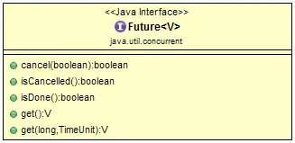
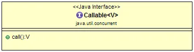

Details on java.util.concurrent.Future :
Future is a generic interface that represents the result of an asynchronous computation. It has the following methods:

1. boolean cancel(boolean mayInterruptIfRunning): Attempts to cancel the computation. If the computation has already completed or cannot be cancelled, this method returns false. Otherwise, it returns true. 
2. boolean isCancelled(): Returns true if the computation was cancelled before it completed normally. 
3. boolean isDone(): Returns true if the computation has completed, whether it completed normally, was cancelled, or terminated due to an exception. 
4. V get() throws InterruptedException, ExecutionException: Waits if necessary for the computation to complete, and then retrieves its result. If the computation was cancelled, this method throws a CancellationException. If the computation completed due to an exception, this method throws an ExecutionException. If the current thread was interrupted while waiting for the result, this method throws an InterruptedException. 
5. V get(long timeout, TimeUnit unit) throws InterruptedException, ExecutionException, TimeoutException: Waits the specified amount of time for the computation to complete, and then retrieves its result. If the computation has not completed within the specified time, this method throws a TimeoutException. Otherwise, it behaves the same as the get() method.

Details on java.util.concurrent.Callable:

Callable is a functional interface that represents a task that can return a result and throw checked exceptions. It has a single method:

1. V call() throws Exception: Computes a result.